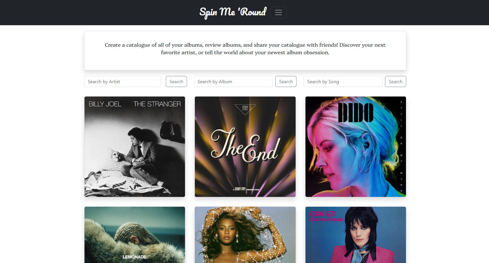
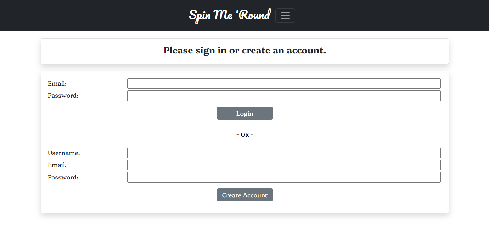
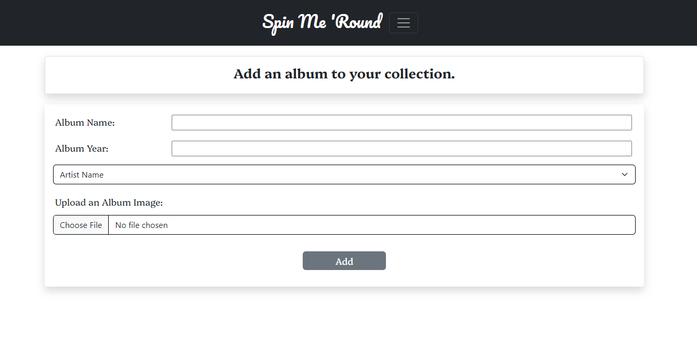
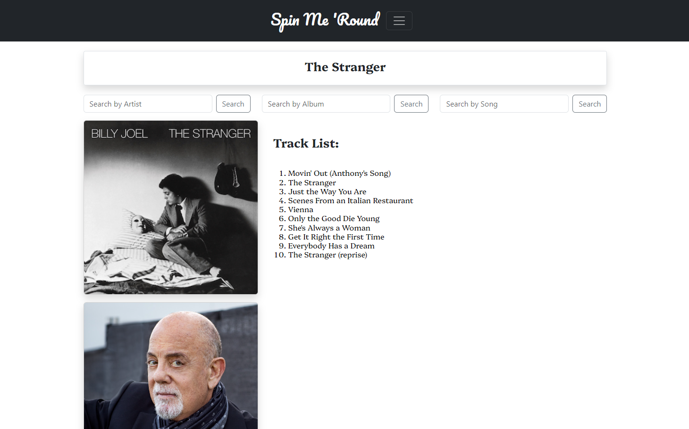
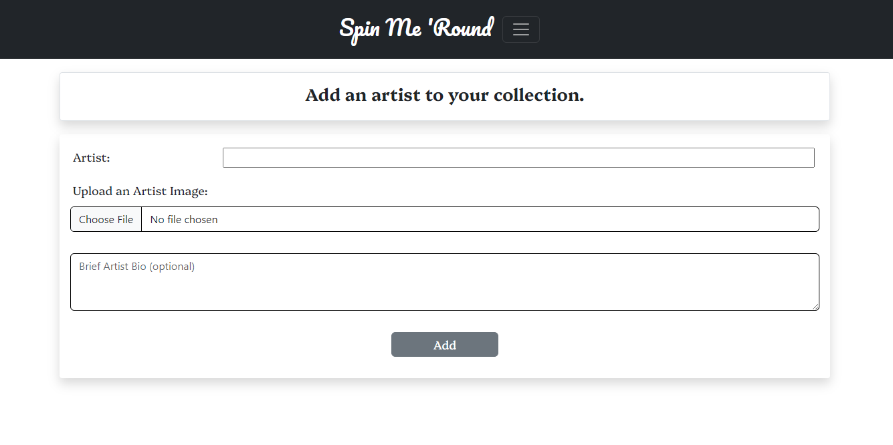
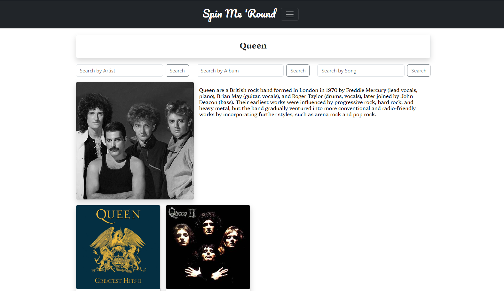
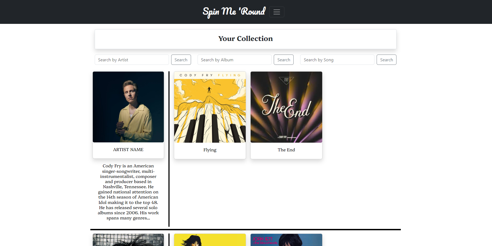

# Spin Me 'Round

A catalogue for your records, and a place to discover new favorites.

## Description

This project was built in order to provide a marketplace for a user to explore albums, artists, and songs; and create a personalized collection of music.

For successful completion, the class was randomly split into two teams. The goal for each team was to design a project which would incorporate all of the tools and elements we have learned thus far in this class. We were tasked with creating a real-world front and back-end application that utilizes API's and the process of creating databases, that are both responsive and interactive.

To accomplish these goals our group combined use of HTML/Bootstrap, JavaScript, CSS, Node.js, Express.js, PostgreSQL, Sequelize, server-side APIs, and databases. It was also required that we use local storage and have an intuitive UI experience with the user's story in mind. Through this process we incorporated some of the key processes learned throughout the class. This included not only integral coding tools but also adopting a collaborative approach to our remote repository, Github.

The final product provides an interactive experience that includes, first and foremost, bringing the user to our homepage. Here, several options are presented: one may perform a search of his/her favorite album, artist, or song; visualize album covers; select any of the album covers (also buttons) to link to a bio of the artist; or utilize a drop-in menu with options to take the user to various pages of the website. This drop-in menu includes options to navigate to the homepage, the user’s personal collection of favorites, an opportunity to login/logout of the site, and links to add an artist or album to their collection.

By completing the exercises as listed herein, students have met the following requirements:

• Use of Node.js and Express.js to create a RESTful API.  
• Use of Handlebars.js as the templating engine.  
• Use of PostgreSQL and the Sequelize ORM for the database.  
• Have both GET and POST routes for retrieving and adding new data.  
• The project should be deployed using Render (with data).  
• Use of at least one new library, package, or technology that was not discussed in class.  
• The project should have a polished UI.  
• The project should be responsive.  
• The project should be interactive (i.e., accept and respond to user input).  
• A folder structure that meets the MVC paradigm should be used.  
• The project should include authentication (express-session and cookies).  
• There should be a protection of API keys and sensitive information with environment variables.  
• The project should have a clean repository that meets quality coding standards (file structure, naming conventions, follows best practices for class/id naming conventions, indentation, quality comments, etc.).  
• The project should have a quality README (with a unique name, description, technologies used, screenshot, and link to the deployed application).  
• The project should be added to the individual portfolio that was created in Module 2.

## Installation

To view the finished product, you will use the OS terminal to add necessary files using the “npm i” command. To create the database, enter “psql -U postgres” into the terminal. Then, use the command “\i db/schema.sql”. Lastly, use the “\q” command to quit the postgres shell. Once the files are loaded, the local server is activated by using the command “nodemon server.js”. This will initiate a continuous monitoring of server activity using nodemon. After the server is identified as connected by showing “now listening on 3001” in the terminal, one must enter the link “localhost:3001” into a browser address bar. From here, the homepage may be viewed. In order to navigate to other pages of the website, one should add the specific page to the end of the link. For example, to navigate to the login page the address “localhost:3001/login” would be entered.

## Usage

Landing page:

The webpage where a user may sign in to his/her account, or create an account:

Add an album to the collection:

Album page:

Add artist page:

Artist page:

User page:

## Deployed Link

https://spin-me-round.onrender.com

##Github Repo

https://github.com/Init-To-Win/spin-me-round.git

## Contributors

https://github.com/MelissaCade  
https://github.com/Meyerst19  
https://github.com/amartin02  
https://github.com/vicduar

## Credits

References

Bootstrap. (2024, April 9-16). Build fast, responsive sites with Bootstrap. Multiple pages retrieved from https://getbootstrap.com/

Coyier, C. (2024, April 16). A complete guide to flexbox. CSS-Tricks. https://css-tricks.com/snippets/css/a-guide-to-flexbox/

Free Code Camp. (2024, April 9-16). Learn to code – for free. Multiple pages retrieved from www.freecodecamp.org

Geeks for Geeks. (2024, April 9-16). Learning website. Retrieved from www.geeksforgeeks.org

MDN. (2024, April 9-16). MDN resources for developers by developers. Multiple pages retrieved from: https://developer.mozilla.org/en-US/

Stack overflow (2024, April 9-16). A public platform building the definitive collection of coding questions & answers. Multiple pages retrieved from www.stackoverflow.com

W3schools. (2024, April 9-16). Learn to Code with the world’s largest we developer site. Multiple pages retrieved from: https://www.w3schools.com/

## License

This project uses the MIT license.
